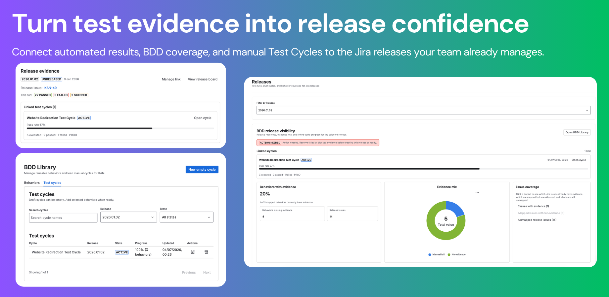
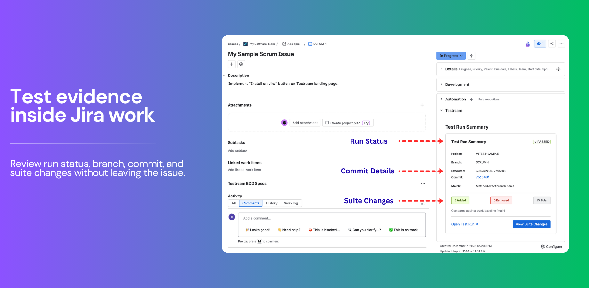
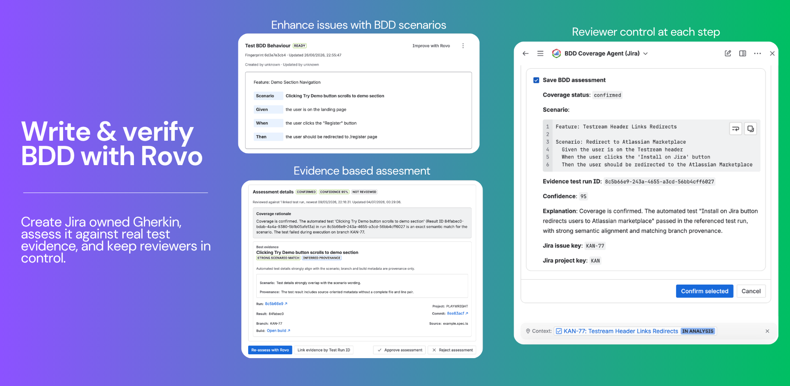
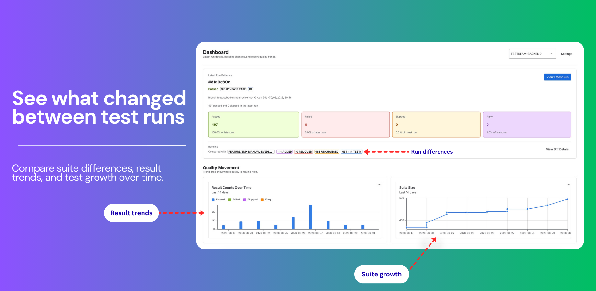
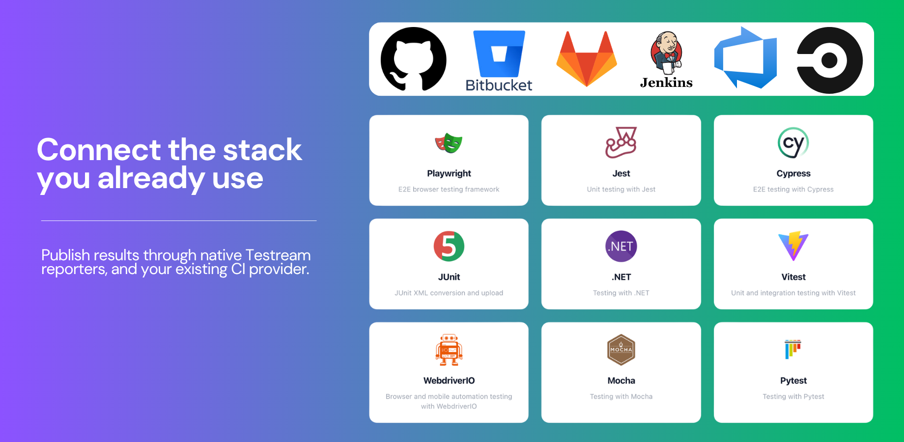

  

<h1 align="center">Test evidence your whole Jira team can trust.</h1>

  Connect automated CI results, reusable BDD behaviors, and manual Test Cycles to the Jira releases your team already manages—so QA, engineering, product, and delivery leaders decide from the same evidence.

  <a href="https://marketplace.atlassian.com/apps/3048460704/testream-automated-test-management-for-jira">Install on Jira</a> ·
  <a href="https://testream.app">Explore Testream</a> ·
  <a href="https://docs.testream.app">Read the docs</a>

  

## What we're building

Testream is automated test management for Jira. It brings together the evidence that usually gets scattered across CI logs, test reports, spreadsheets, and release conversations:

- automated test results, failures, artifacts, and suite changes from the pipelines you already run;
- reusable BDD behaviors that connect requirements to executable and manual validation;
- focused Test Cycles for recording manual outcomes and evidence; and
- release visibility that shows what changed, what is covered, and where confidence is still missing.

The result is a shared quality signal inside Jira—one place for teams to inspect evidence, collaborate on risk, and make release decisions.

## One connected quality signal

<table>
  <tr>
    <td width="38%" valign="top">
      <h3>Automated evidence inside Jira</h3>
      
Bring pass/fail results, errors, stack traces, screenshots, traces, videos, logs, commits, and build context into the Jira work items your team already uses.

      
<a href="https://testream.app/features/automated-test-reporting">Explore automated reporting →</a>

    </td>
    <td width="62%">
      
    </td>
  </tr>
  <tr>
    <td width="38%" valign="top">
      <h3>Write and verify BDD behaviors</h3>
      
Keep Gherkin specifications reusable and connected to Jira context, then use captured evidence and Rovo-assisted workflows to improve coverage and review gaps.

      
<a href="https://testream.app/features/bdd-specs">Explore BDD Specs →</a> · <a href="https://testream.app/features/bdd-rovo-agent">BDD Coverage Agent</a>

    </td>
    <td width="62%">
      
    </td>
  </tr>
  <tr>
    <td width="38%" valign="top">
      <h3>See what changed before release</h3>
      
Connect automated runs and manual validation to release work so teams can review suite changes, coverage gaps, linked cycles, and current readiness together.

      
<a href="https://testream.app/features/release-visibility">Explore release visibility →</a>

    </td>
    <td width="62%">
      
    </td>
  </tr>
</table>

## Built for the stack you already use

  

Publish from Playwright, Cypress, Jest, Vitest, Mocha, WebdriverIO, Pytest, JUnit XML, .NET, or any CTRF-producing test stack. Run the publishing step from the command-capable CI provider your team already operates.

  <a href="https://docs.testream.app/getting-started/installation#reporters">Choose a reporter</a> ·
  <a href="https://testream.app/features/integrations">See integrations</a>

## Published packages and working examples

Install the package for the test stack you already use, then use the corresponding public repository as a working configuration and CI reference.

| Test stack | npm package | Working example |
| --- | --- | --- |
| Playwright | [`@testream/playwright-reporter`](https://www.npmjs.com/package/@testream/playwright-reporter) | [`playwright-jira-reporter`](https://github.com/testream/playwright-jira-reporter) |
| Cypress | [`@testream/cypress-reporter`](https://www.npmjs.com/package/@testream/cypress-reporter) | [`cypress-jira-reporter`](https://github.com/testream/cypress-jira-reporter) |
| Jest | [`@testream/jest-reporter`](https://www.npmjs.com/package/@testream/jest-reporter) | [`jest-jira-reporter`](https://github.com/testream/jest-jira-reporter) |
| Vitest | [`@testream/vitest-reporter`](https://www.npmjs.com/package/@testream/vitest-reporter) | [`vitest-jira-reporter`](https://github.com/testream/vitest-jira-reporter) |
| Mocha | [`@testream/mocha-reporter`](https://www.npmjs.com/package/@testream/mocha-reporter) | [`mocha-jira-reporter`](https://github.com/testream/mocha-jira-reporter) |
| WebdriverIO | [`@testream/webdriverio-reporter`](https://www.npmjs.com/package/@testream/webdriverio-reporter) | [`webdriverio-jira-reporter`](https://github.com/testream/webdriverio-jira-reporter) |
| Pytest | [`@testream/pytest-reporter`](https://www.npmjs.com/package/@testream/pytest-reporter) | [`pytest-jira-reporter`](https://github.com/testream/pytest-jira-reporter) |
| JUnit XML | [`@testream/junit-reporter`](https://www.npmjs.com/package/@testream/junit-reporter) | [`junit-jira-reporter`](https://github.com/testream/junit-jira-reporter) |
| .NET | [`@testream/dotnet-reporter`](https://www.npmjs.com/package/@testream/dotnet-reporter) | [`dotnet-jira-reporter`](https://github.com/testream/dotnet-jira-reporter) |
| Any CTRF output | [`@testream/cli`](https://www.npmjs.com/package/@testream/cli) | [`ctrf-jira-reporter`](https://github.com/testream/ctrf-jira-reporter) |

Browse the full [Testream npm organization](https://www.npmjs.com/org/testream) or [all public working repositories](https://github.com/orgs/testream/repositories).

## Start with one real run

1. [Install Testream for Jira](https://marketplace.atlassian.com/apps/3048460704/testream-automated-test-management-for-jira).
2. Create or select a Jira project and connect its Testream settings.
3. Install the reporter that matches your test stack and configure `TESTREAM_API_KEY` in CI.
4. Run your tests, inspect the evidence in Jira, and connect the run to the release or issue it informs.

[Follow the Quick Start](https://docs.testream.app/getting-started/quick-start) · [Read the installation guide](https://docs.testream.app/getting-started/installation) · [Explore Testream](https://testream.app)
